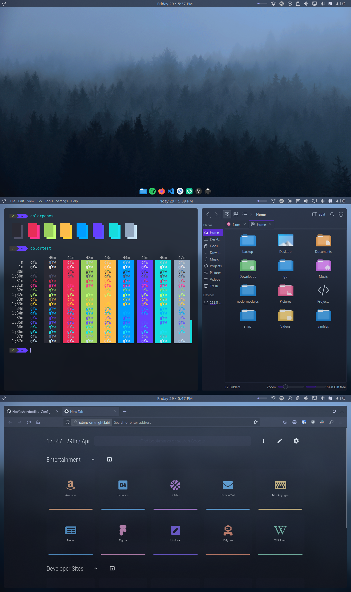
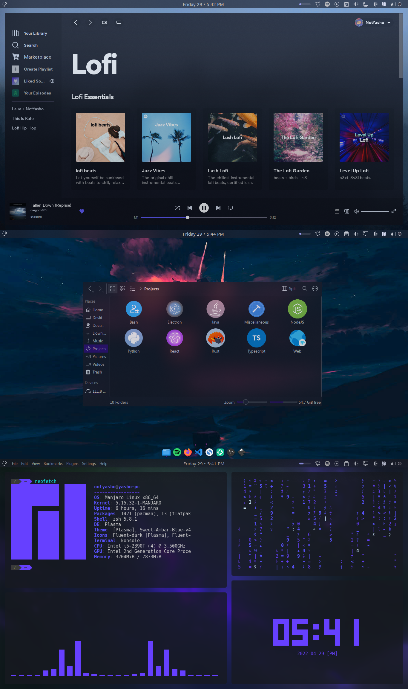

# KDE Plasma Dotfiles

**Note: This backup is automated with a shell script running on crontab** *Nothing, just wanted to flex*

## Contents

- [Installation (manual)](#manual)
- [Installation (Konsave)](#konsave)
- [Theme](#theme)
- [Kwin Scripts](#kwin-scripts)




## Installation

### Manual

Clone this repository to your home directory

***WARNING: This will overwrite your current dotfiles. Make sure to have a backup.***

```console
git clone https://www.github.com/NotYasho/dotfiles.git ~
```

### Konsave

You can also import the configuration automatically.

**Due to the Github 100mb file limit, the file is not in this repository.**
You can download it from Google Drive:

#### [Download [211MB]](https://drive.google.com/u/0/uc?id=1fOrmzdrGB5Z8ovuiuRCZlMVBQUtIHmRr&export=download)

Then follow these steps:

- First, Install konsave from pip

```console
python3 -m pip install konsave
```

- Then, import the configuration and apply

```console
konsave -i "path/to/Sweet-Dark-KDE.knsv" # change to the path of the .knsv file
konsave -a "Sweet-Dark-KDE"
```

*Special thanks to [u/haxguru](https://www.reddit.com/r/kde/comments/ltsnfc/you_can_now_save_your_plasma_configuration_in_an/) for this [awesome project](https://github.com/Prayag2/konsave)*.

---

### Theme

- Window Decorations: [Sweet](https://store.kde.org/p/1294174)

- Window Decorations: [Sweet Dark Transparent](https://store.kde.org/p/1294174)
- Colors: [Sweet](https://store.kde.org/p/1294174)
- Font: Primary - Segoe UI, Monospace - Jetbrains Mono
- Terminal Font: Hack Nerd Font
- Icons: [Fluent Dark](https://store.kde.org/p/1477945/)
- Cursor: [Sweet-cursors](https://store.kde.org/p/1393084/)
- VSCode Theme: [Ocean High Contrast](https://marketplace.visualstudio.com/items?itemName=NotYasho.ocean-high-contrast)
- Firefox Theme: [Tokyo Night Purple](https://addons.mozilla.org/en-US/firefox/addon/tokyo-night-purple/)
- Firefox New Tab: [NightTab](https://addons.mozilla.org/en-US/firefox/addon/nighttab/)

### Applications

- Dock: [Latte Dock](https://store.kde.org/p/1169519)
- Code Editor: [Visual Studio Code](https://code.visualstudio.com/)
- File Explorer: Dolphin
- Terminal: Konsole
- Browser: [Firefox](https://www.mozilla.org/en-US/firefox/new/)

### Kwin Scripts

- Force Blur
- [Grid-Tiling](https://github.com/lingtjien/Grid-Tiling-Kwin)

---
