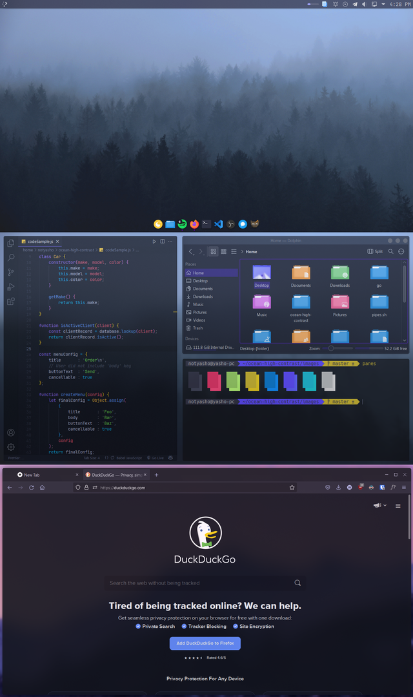
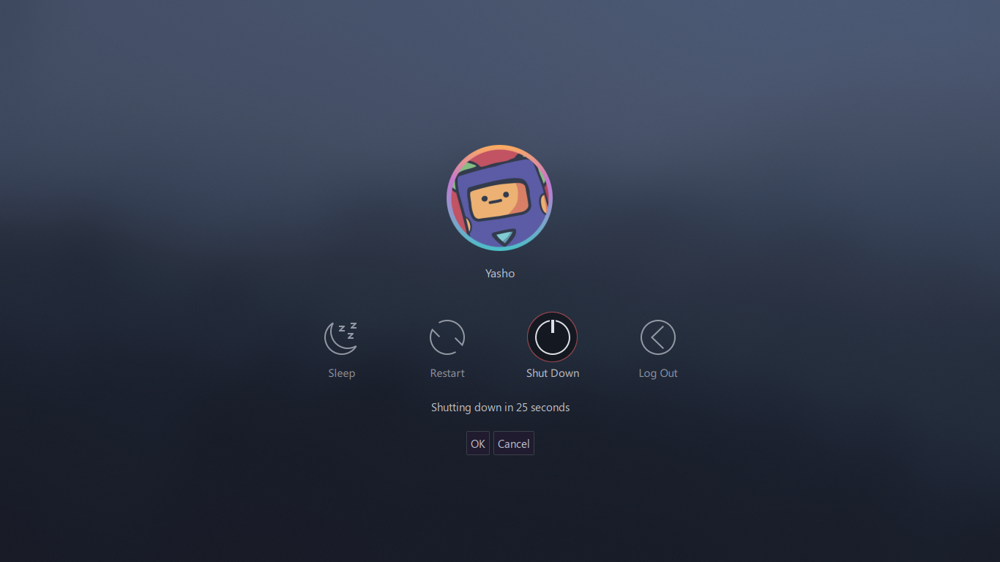

# dotfiles

### Theme

- Window Decorations: [Sweet](https://store.kde.org/p/1294174)
- Colors: [Sweet](https://store.kde.org/p/1294174)
- Font: Primary - Segoe UI, Monospace - Jetbrains Mono
- Terminal Font: Hack Nerd Font
- Icons: [Fluent Dark](https://store.kde.org/p/1280231)
- Cursor: [Sweet-cursors](https://store.kde.org/p/1393084/)
- [Wallpapers](https://imgur.com/a/jYjd4Pe)
- VSCode Theme: [Ocean High Contrast](https://marketplace.visualstudio.com/items?itemName=NotYasho.ocean-high-contrast)
- Firefox Theme: [Tokyo Night Purple](https://addons.mozilla.org/en-US/firefox/addon/tokyo-night-purple/)

### Applications

- Dock: [Latte Dock](https://store.kde.org/p/1169519)
- Code Editor: [Visual Studio Code](https://code.visualstudio.com/)
- File Explorer: Dolphin
- Terminal: Konsole
- Browser: [Firefox](https://www.mozilla.org/en-US/firefox/new/)

### Kwin Scripts
- Force Blur
- Tile Gaps

*thank you for all the upvotes on reddit ​<3*
